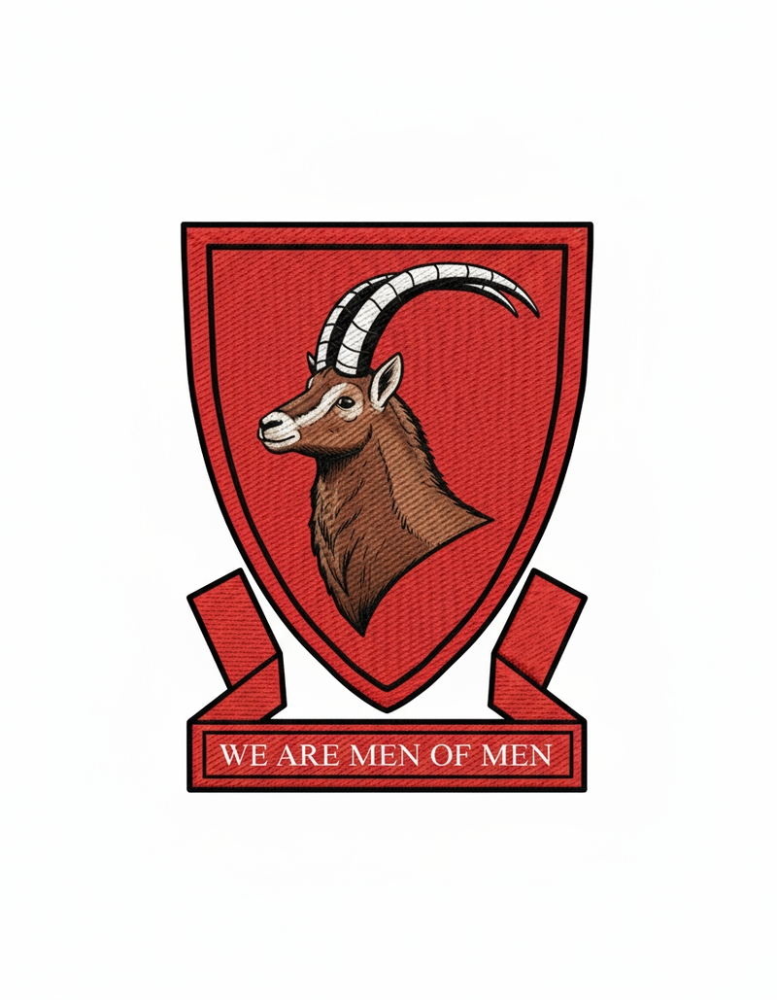
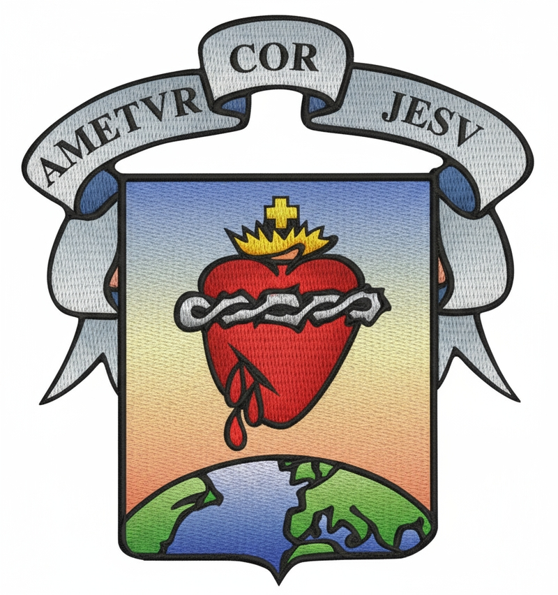
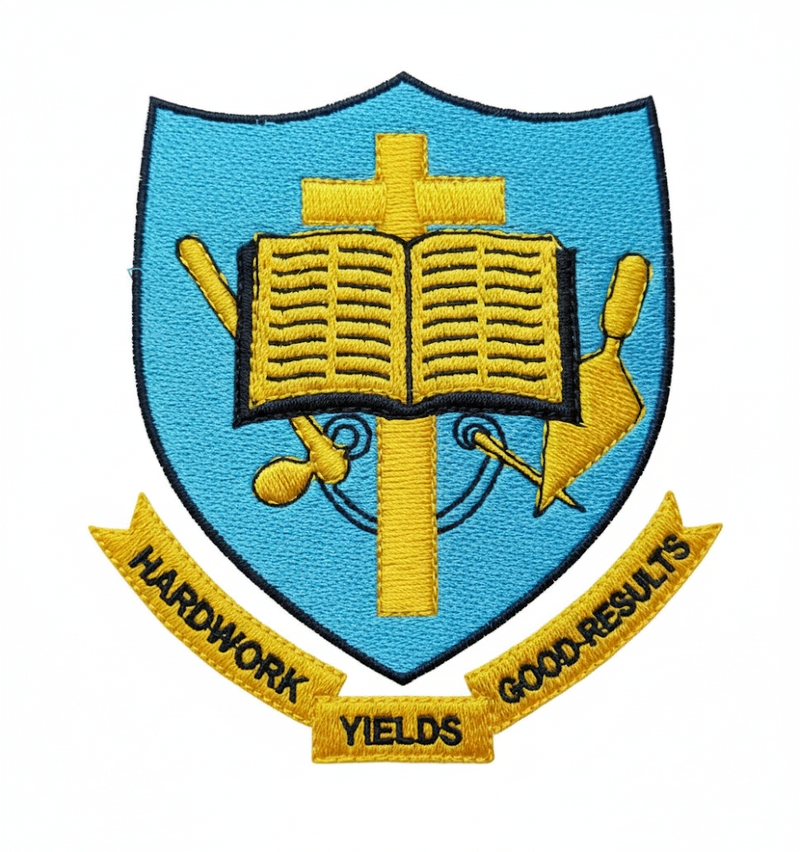
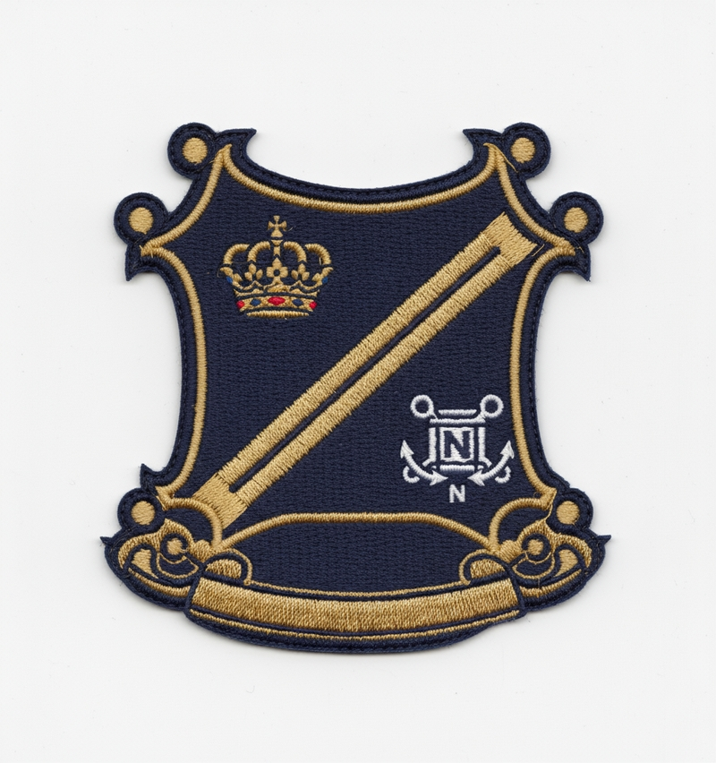
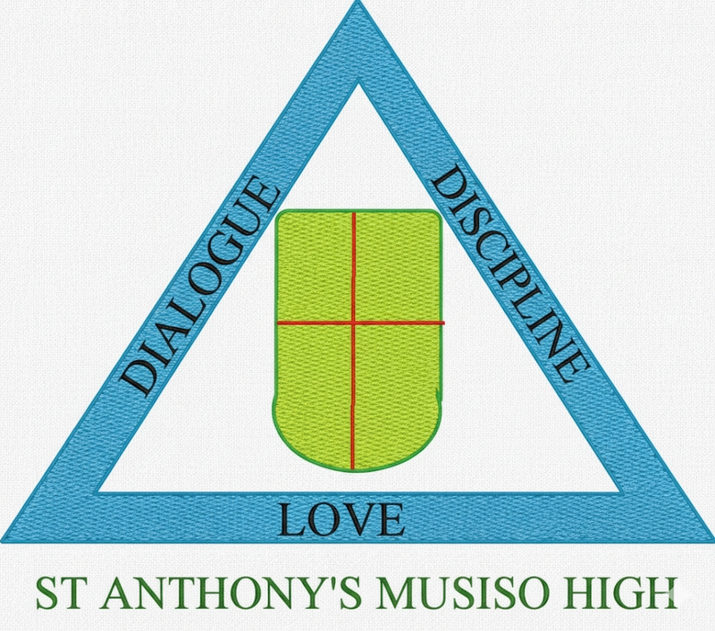
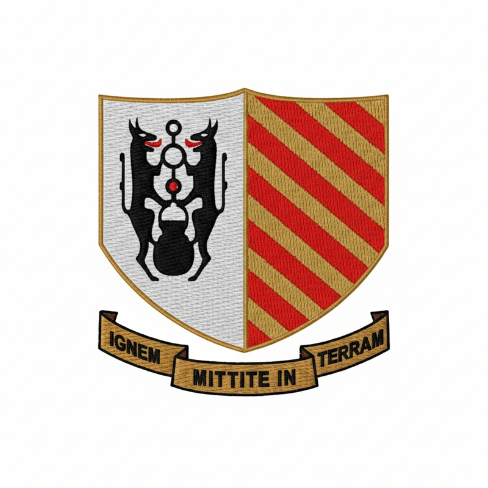
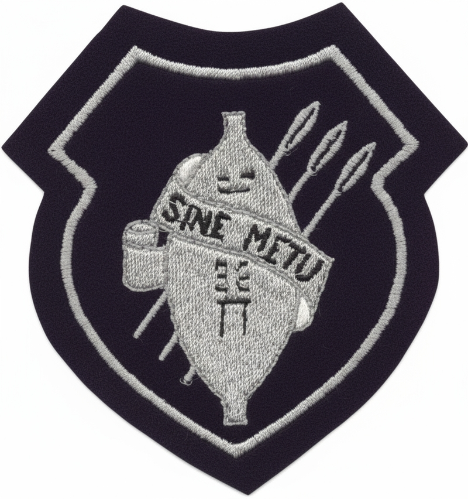

# Zimbabwe School Website Generator


A dynamic web application that automatically generates a modern, single-page website for any high school in Zimbabwe using its name and logo. The application leverages Google's Gemini AI to gather public information and construct a complete HTML page on the fly.

**Live Preview:** **[https://zimbabwe-schools.netlify.app/](https://zimbabwe-schools.netlify.app/)**

## Screenshots


Bradley High School Generated website 


## ✨ Features

-   **AI-Powered Content Generation**: Uses Google's Gemini AI with web search capabilities to generate up-to-date content for sections like "About Us," "Academics," and "Contact."
-   **Dynamic Color Theming**: Automatically extracts a color palette from the school's logo to create a visually consistent and branded website theme.
-   **Fuzzy Search**: Implements Fuse.js to provide a robust and typo-tolerant search experience for finding schools.
-   **Serverless Architecture**: Built entirely on Netlify, using Netlify Functions for the backend logic, ensuring scalability and low maintenance.
-   **Firestore Caching**: Integrates with Google Firestore to cache generated websites for 24 hours, providing instant load times for subsequent visits and reducing API costs.
-   **On-Demand Regeneration**: Allows force-refreshing a school's page via a query parameter (`?new=true`) to fetch the latest information.

## 🛠️ How It Works & Tech Stack

The application has a simple frontend and a powerful serverless backend that handles the heavy lifting.

**The Workflow:**

1.  **User Search (Frontend):** A user searches for a school on the React-based homepage.
2.  **API Call:** The frontend calls a Netlify Serverless Function at `/api/school/:schoolName`.
3.  **School Matching (Backend):** The function uses **Fuse.js** to perform a fuzzy search on a local `schools.json` file to find the correct school name and logo URL.
4.  **Cache Check:** The function checks **Firebase Firestore** for a valid, non-expired cached version of the school's HTML page. If a valid cache exists, it's returned immediately.
5.  **AI Generation (on Cache Miss):**
    a. **Color Extraction**: The function uses **`node-vibrant`** to extract a primary, secondary, and accent color from the school's logo.
    b. **Prompt Engineering**: A detailed prompt is constructed for **Google Gemini**, providing the school's name, logo URL, and the extracted color palette. The prompt instructs the AI to act as a web developer, use TailwindCSS, and search the web for factual information.
    c. **AI Call**: The function calls the Gemini API, which uses its `googleSearch` tool to find information and generate a complete, single-file HTML website.
6.  **Caching Result:** The newly generated HTML is saved to Firestore with a 24-hour expiration timestamp.
7.  **Response:** The HTML is sent back to the frontend.
8.  **Display:** The React frontend renders the received HTML inside a sandboxed `<iframe>` to display the generated website.

### Tech Stack

| Category            | Technology                                                                                                    |
| ------------------- | ------------------------------------------------------------------------------------------------------------- |
| **Frontend**        | [React](https://reactjs.org/), [React Router](https://reactrouter.com/), [TailwindCSS](https://tailwindcss.com/) |
| **Backend**         | [Netlify Functions](https://docs.netlify.com/functions/overview/) (Node.js)                                   |
| **AI Generation**   | [Google Gemini API](https://ai.google.dev/) (`gemini-2.5-flash-lite` with Search)                               |
| **Database/Cache**  | [Google Firestore](https://firebase.google.com/docs/firestore)                                                |
| **Search**          | [Fuse.js](https://fusejs.io/)                                                                                 |
| **Color Extraction**| [Node-Vibrant](https://github.com/vibrant-js/node-vibrant)                                                      |
| **Deployment**      | [Netlify](https://www.netlify.com/)                                                                           |

## 🚀 Getting Started

### Prerequisites

-   Node.js and npm
-   A Netlify account
-   A Google Cloud account with the Gemini API enabled
-   A Firebase project with Firestore enabled

### 1. Clone the Repository

```bash
git clone https://github.com/your-username/zimbabwe-schools.git
cd zimbabwe-schools
```

### 2. Install Dependencies

```bash
npm install
```

### 3. Set Up Environment Variables

Create a `.env` file in the root of the project and add the following variables.

```env
# Your Gemini API Key from Google AI Studio or Google Cloud
GEMINI_API_KEY=your_gemini_api_key

# Your Firebase service account credentials, encoded in Base64
# 1. Go to Firebase > Project Settings > Service accounts
# 2. Generate a new private key (JSON file)
# 3. Base64-encode the *entire content* of the JSON file
#    (You can use an online tool or `base64 -i serviceAccountKey.json` on macOS/Linux)
FIREBASE_SERVICE_ACCOUNT_BASE64=your_base64_encoded_firebase_credentials
```

### 4. Run Locally

The Netlify CLI is the best way to run the project locally as it emulates the entire platform, including functions.

```bash
# Install Netlify CLI if you haven't already
npm install -g netlify-cli

# Run the project
netlify dev
```

Your application will be running at `http://localhost:8888`.

## 📁 Project Structure

```
/
├── frontend/                 # Contains the React frontend application
│   ├── public/
│   │   └── data/
│   │       └── schools.json  # Master list of schools and their logo URLs
│   ├── src/
│   │   ├── components/       # Reusable React components
│   │   ├── pages/            # Page components (HomePage, SchoolPage)
│   │   ├── App.tsx           # Main app component with routing
│   │   └── index.tsx         # Entry point for the React app
│   └── ...
├── netlify/
│   └── functions/
│       └── school.ts         # The core serverless function for AI generation
├── .env                      # Local environment variables (ignored by git)
├── netlify.toml              # Netlify configuration file
└── package.json
```

## 🌐 Deployment

This project is configured for seamless deployment on Netlify.

1.  Push your code to a GitHub/GitLab/Bitbucket repository.
2.  Connect the repository to a new site on your Netlify dashboard.
3.  **Configure Build Settings**:
    -   **Build command**: `npm run build`
    -   **Publish directory**: `frontend/dist`
    -   **Functions directory**: `netlify/functions`
4.  **Add Environment Variables**: Go to `Site settings > Build & deploy > Environment` and add the `GEMINI_API_KEY` and `FIREBASE_SERVICE_ACCOUNT_BASE64` variables, just like you did for your `.env` file.
5.  Trigger a deploy. Your site will be live!

---


# Embroidered Logos for Zimbabwean High Schools

Eaglesvale | Kutama | Regina Mundi
:---:|:---:|:---:
 |  | 

St Peters (Mbare) Secondary | Kwenda | Roosevelt Girls
:---:|:---:|:---:
_secondary.png) |  | 

All Souls | Langham | Rusununguko
:---:|:---:|:---:
 |  | 

Allan Wilson | Loreto | Ruya Adventist
:---:|:---:|:---:
 |  | 

Alpha College | Makumbe | Sandringham
:---:|:---:|:---:
 |  | 

Anderson | Mandedza | Sanyati Baptist
:---:|:---:|:---:
 |  | 

Bernard Mzeki | Marange | Serima
:---:|:---:|:---:
 |  | 

Bradley | Marist Brothers Nyanga | Shungu
:---:|:---:|:---:
 |  | 

Chemanza | Marondera | Silveira
:---:|:---:|:---:
 |  | 

Chibi | Mashoko | St Alberts
:---:|:---:|:---:
 |  | 

Chikwingwizhza | Mazowe | St Anne's Goto
:---:|:---:|:---:
 |  | 

Chindunduma | Moleli | St Anthony Musiso
:---:|:---:|:---:
 |  | 

Chinhoyi 2 | Monte Cassino | St Benedict's
:---:|:---:|:---:
 |  | 

Chinhoyi | Msengezi | St Columba
:---:|:---:|:---:
 |  | 

Churchill | Mt Selinda | St David's Bonda
:---:|:---:|:---:
 |  | 

Dadaya | Mt St Mary's | St Dominics Chishawasha
:---:|:---:|:---:
 |  | 

Daramombe | Mtshabezi | St Faith's
:---:|:---:|:---:
 |  | 

Emmanuel | Mucheke | St Francis of Assisi
:---:|:---:|:---:
 |  | 

Girls High Harare | Mufakose 1 High | St Ignatius
:---:|:---:|:---:
 |  | 

Gokomere | Mukaro | St Johns Chikwaka
:---:|:---:|:---:
 |  | 

Goromonzi | Murewa | St Johns Emerald Hill
:---:|:---:|:---:
 |  | 

Green Gables | Mutendi | St Joseph's
:---:|:---:|:---:
 |  | 

Hama | Nagle | St Killians
:---:|:---:|:---:
 |  | 

Hartzell | Ndararama | St Matthias
:---:|:---:|:---:
 |  | 

Holy Cross | Nyahuni | St Michaels
:---:|:---:|:---:
 |  | 

Howard | Nyashanu | St Patrick
:---:|:---:|:---:
 |  | 

Inyathi | Nyazura | St Pauls Musami
:---:|:---:|:---:
 |  | 

Jameson | Pakame | St Philips
:---:|:---:|:---:
 |  | 

John Tallach | Pamushana | Thekwane
:---:|:---:|:---:
 |  | 

Knowledgevill College | Presbyterian | Waddilove
:---:|:---:|:---:
 |  | 

Kriste Mambo | Queen Elizabeth | Visitation Makumbi
:---:|:---:|:---:
 |  |  
